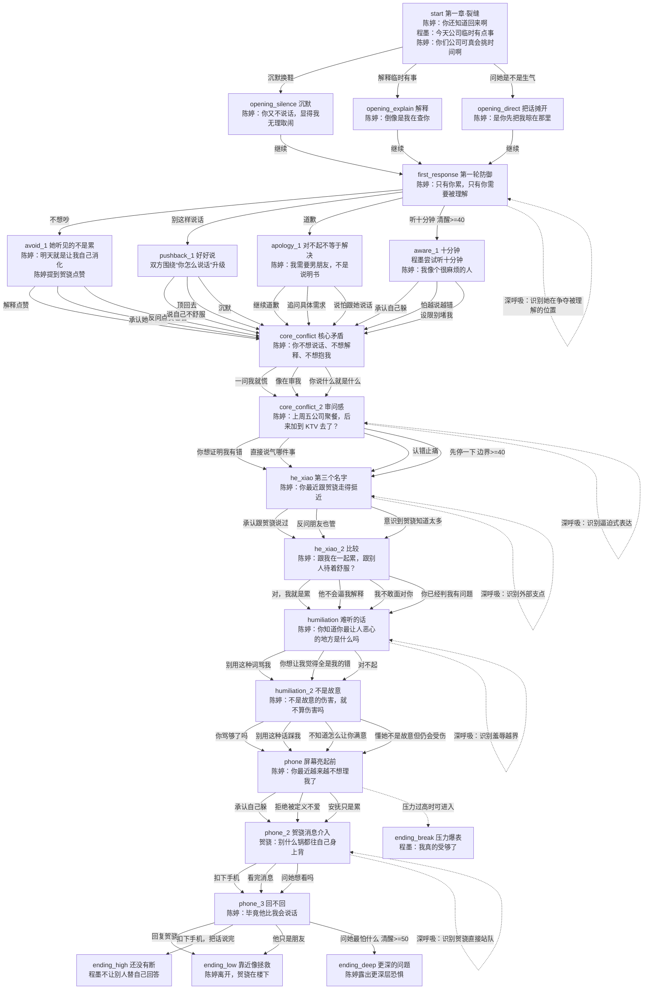

# 第一章《裂缝》对话流程图

## 总流程

## 选项明细表

| 节点 | 玩家选择 | 选择背后的行为 | 数值影响 | 导向 |
|---|---|---|---|---|
| start | 装作没听见，低头换鞋 | 逃避冲突 | 清醒-2 / 压力-1 / 边界-2 | opening_silence |
| start | 解释：“真是临时有事，不是故意晚回来。” | 解释事实，不接情绪 | 压力+2 | opening_explain |
| start | 停下来问：“你是在生气我晚回来？” | 把暗刺拉明 | 清醒+4 / 压力+3 / 边界+2 | opening_direct |
| first_response | 深呼吸 | 识别陈婷在争夺“被理解”的位置 | 消耗技能 | 留在 first_response |
| first_response | 我今天真的不想吵 | 降压式逃避 | 清醒-2 / 压力-3 / 边界-2 | avoid_1 |
| first_response | 你能不能别每次都这样说话？ | 守边界但升温 | 压力+6 / 边界+5 | pushback_1 |
| first_response | 我知道你等我很久了，对不起 | 先道歉，偏讨好 | 压力+2 / 边界-2 / 信任陈婷+2 | apology_1 |
| first_response | 我现在很累，但我愿意听你说十分钟 | 沟通并保护状态 | 清醒+5 / 压力+2 / 边界+4 / 信任陈婷+2 | aware_1 |
| avoid_1 | 我只是随手点的 | 继续解释具体行为 | 压力+2 / 贺骁控局+1 | core_conflict |
| avoid_1 | 这件事让你不舒服，我刚才没意识到 | 接住对方介意 | 清醒+4 / 压力+2 / 信任陈婷+2 | core_conflict |
| avoid_1 | 你现在连我给谁点赞都要管？ | 反击控制感 | 压力+7 / 边界+5 / 信任陈婷-3 | core_conflict |
| pushback_1 | 我不是说你不对，我是听着真的不舒服 | 把攻击拉回感受 | 清醒+4 / 压力+2 / 边界+4 | core_conflict |
| pushback_1 | 所以只准你难受，不准我难受？ | 公平感反击 | 压力+6 / 边界+3 | core_conflict |
| pushback_1 | 沉默，不再解释 | 冷处理 | 清醒-2 / 压力-2 / 边界-3 | core_conflict |
| apology_1 | 我以后一定改 | 快速止痛式承诺 | 压力-2 / 边界-5 / 陈婷控制+2 | core_conflict |
| apology_1 | 那你现在最想让我做的一件事是什么？ | 把指责变具体 | 清醒+5 / 压力+2 / 边界+2 | core_conflict |
| apology_1 | 我真的有点怕跟你说话 | 暴露脆弱 | 清醒+3 / 压力+4 / 信任陈婷-1 | core_conflict |
| aware_1 | 你不是麻烦，是我最近老想躲着不说 | 承认逃避 | 清醒+6 / 压力+3 / 信任陈婷+3 | core_conflict |
| aware_1 | 我只是怕越说越错 | 解释防御 | 清醒+2 / 压力+1 | core_conflict |
| aware_1 | 我会听，但你别一句一句堵我 | 沟通中设限 | 清醒+4 / 压力+4 / 边界+6 | core_conflict |
| core_conflict | 我不是不让你问，是你一问我就慌 | 表达状态 | 清醒+3 / 压力+2 | core_conflict_2 |
| core_conflict | 你每次问起来就像在审我 | 说真实感受但攻击性强 | 压力+4 / 边界+3 | core_conflict_2 |
| core_conflict | 算了，你说什么就是什么 | 表面退让，实际冷处理 | 清醒-2 / 压力-2 / 边界-4 / 陈婷控制+2 | core_conflict_2 |
| core_conflict_2 | 深呼吸 | 识别逼迫式表达 | 消耗技能 | 留在 core_conflict_2 |
| core_conflict_2 | 你是不是就是想证明我有错？ | 进入互相防御 | 压力+8 / 边界+3 / 信任陈婷-3 | he_xiao |
| core_conflict_2 | 你到底在气哪件事，能不能直接说？ | 推动真实问题 | 清醒+4 / 压力+3 / 边界+5 / 信任陈婷+2 | he_xiao |
| core_conflict_2 | 好，是我的问题。你别生气了 | 认错止痛 | 清醒-2 / 压力-4 / 边界-6 / 信任陈婷+2 / 陈婷控制+3 | he_xiao |
| core_conflict_2 | 我们现在越说越难听，先停一下 | 中止升级 | 清醒+7 / 压力-2 / 边界+3 | he_xiao |
| he_xiao | 深呼吸 | 识别贺骁作为外部支点 | 消耗技能 | 留在 he_xiao |
| he_xiao | 这些是我跟他说的 | 承认把关系压力外泄 | 清醒+3 / 压力+4 / 贺骁控局+3 | he_xiao_2 |
| he_xiao | 连我朋友也要一起算进去吗？ | 用边界反击 | 压力+5 / 边界+5 / 信任陈婷-2 | he_xiao_2 |
| he_xiao | 他好像确实知道得有点多 | 对贺骁介入警觉 | 清醒+6 / 压力+2 / 贺骁控局-1 | he_xiao_2 |
| he_xiao_2 | 对，我就是觉得累 | 真实但伤人 | 压力+10 / 边界+2 / 贺骁控局+5 / 信任陈婷-5 | humiliation |
| he_xiao_2 | 他只是不会一直逼我解释 | 把贺骁放进比较位 | 清醒-2 / 压力+8 / 边界-1 / 贺骁控局+6 / 信任陈婷-4 | humiliation |
| he_xiao_2 | 我跟他没什么，但我确实不太敢面对你 | 承认自己的问题 | 清醒+8 / 压力+5 / 边界+2 / 信任陈婷+4 | humiliation |
| he_xiao_2 | 你不是在问我，是已经判我有问题 | 守边界但继续冲突 | 清醒+3 / 压力+7 / 边界+7 / 信任陈婷-3 | humiliation |
| humiliation | 深呼吸 | 识别羞辱越界 | 消耗技能 | 留在 humiliation |
| humiliation | 可以说我哪里不对，但别骂我 | 明确边界 | 清醒+4 / 压力+3 / 边界+6 | humiliation_2 |
| humiliation | 你就是想让我觉得全是我的错 | 识别施压但激化 | 清醒+4 / 压力+6 / 边界+4 | humiliation_2 |
| humiliation | 对不起，我知道你很难受 | 接住情绪但压低自己 | 压力+1 / 边界-2 / 信任陈婷+2 | humiliation_2 |
| humiliation_2 | 你骂够了吗？ | 冲突爆炸 | 压力+10 / 边界+4 / 信任陈婷-4 | phone |
| humiliation_2 | 你可以生气，但别用这种话踩我 | 关键边界 | 清醒+5 / 压力+4 / 边界+8 / 信任陈婷+1 | phone |
| humiliation_2 | 我真的不知道怎么让你满意 | 无力感增强 | 清醒-3 / 压力+5 / 边界-4 / 陈婷控制+3 | phone |
| humiliation_2 | 我懂你的意思了。不是故意，但你还是会难受 | 真正接住问题 | 清醒+8 / 压力+3 / 边界+1 / 信任陈婷+4 | phone |
| phone | 我可能真的有点躲你 | 承认变化 | 清醒+6 / 压力+3 / 信任陈婷+3 | phone_2 |
| phone | 你别一吵架就说我是不是不爱你了 | 拒绝被定义 | 压力+5 / 边界+5 | phone_2 |
| phone | 我只是累了，不是要离开你 | 安抚但未触及核心 | 压力-1 / 信任陈婷+2 | phone_2 |
| phone_2 | 深呼吸 | 识别贺骁直接站队 | 消耗技能 | 留在 phone_2 |
| phone_2 | 先不看手机，把屏幕扣过去 | 不让外人进入现场 | 清醒+3 / 边界+4 / 贺骁控局-2 | phone_3 |
| phone_2 | 下意识看完消息 | 被贺骁影响 | 清醒-1 / 压力+2 / 贺骁控局+4 | phone_3 |
| phone_2 | 问陈婷：“你想看吗？” | 透明但推给对方 | 压力+4 / 边界-1 / 信任陈婷+2 | phone_3 |
| phone_3 | 当着陈婷回复贺骁 | 外人进入现场 | 清醒-2 / 压力+8 / 边界-3 / 贺骁控局+6 / 信任陈婷-4 | ending_low |
| phone_3 | 把手机扣下：“我们先把话说完。” | 守住两人空间 | 清醒+3 / 压力+3 / 边界+5 / 信任陈婷+4 / 贺骁控局-2 | ending_high |
| phone_3 | 他只是朋友，你别多想 | 无效解释 | 清醒-1 / 压力+4 / 边界-2 / 贺骁控局+3 | ending_low |
| phone_3 | 你刚才看到这条消息，最怕的到底是什么？ | 深层沟通，清醒>=50 | 清醒+8 / 压力+5 / 边界+2 / 信任陈婷+5 / 陈婷控制+2 | ending_deep |

## 当前结构判断

- 第一章主干是线性推进，中间每组选择会影响数值，但大部分都会汇入下一个共同剧情节点。
- 真正改变结局的关键分支集中在 `phone_3`。
- 第一章的隐藏线索落在陈婷身上：她知道程墨和贺骁去过 KTV，但程墨没有告诉过她。
- 贺骁介入不是从第二章才开始，而是在第一章通过“点赞”和“消息”两次被放进关系现场。
- `ending_break` 目前在剧情数据里存在，但没有显式选项导入；如果要启用，需要在压力过高时由程序自动跳转，或给某个高压选项直接导向它。
